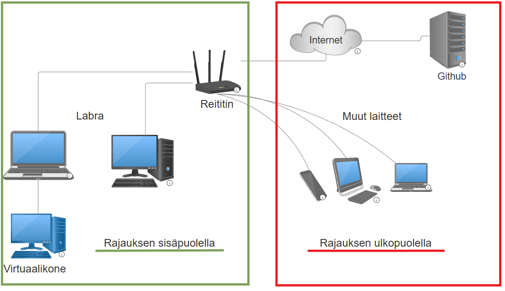
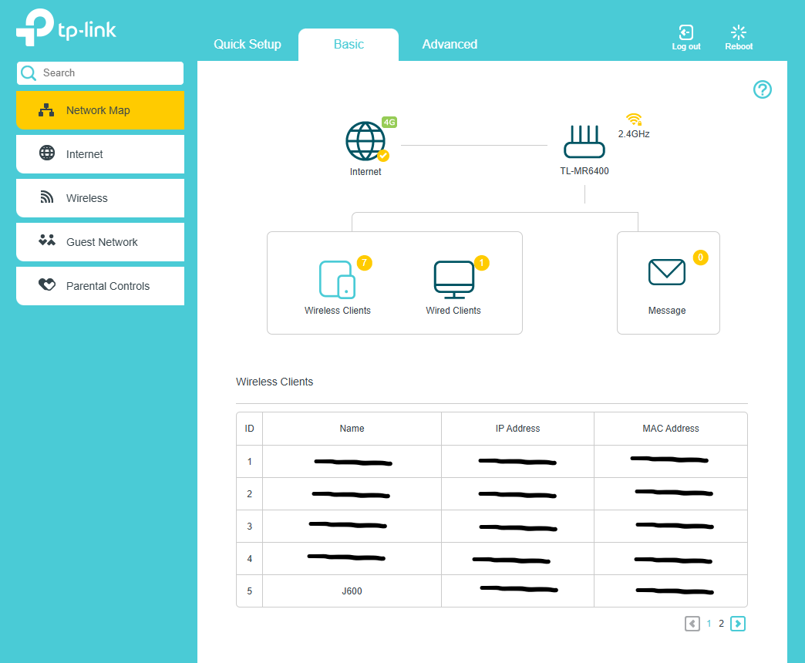
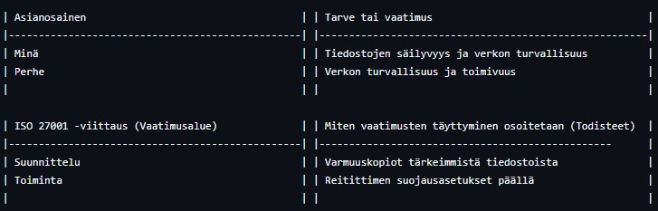

# Freedom of Action, Control, and Risk Mitigation  

## a) Perustaso. Määritä kotiverkkosi ja tutkimuslaboratoriosi tietoturvan hallintajärjestelmän (ISMS) soveltamisala  

### a1) Mitä kokonaisuuteen sisältyy?  
Verkkoinfrastruktuuriin kuuluu yksi reititin.  
Laitteet, joita käytetään tehtävissä: pöytäkone, kannettava ja virtuaalikone.  
Tieto ja data: Koneissa on sisällä salasanoja tileille, koulutehtävien dokumentaatiota ja henkilötietoja.  

### a2) Mikä on rajattu soveltamisalan ulkopuolelle ja miksi?  
Soveltamisalan ulkopuolelle jää kaikki muut, kuin edellä mainitut laitteet.  
Syynä epäolennaisuus tehtäville.  

### a3) Keskeiset rajapinnat ja rajat  
Pilvipalvelut ja oppilaitoksen oppimisen hallintajärjestelmä: Github, Moodle ja terokarvinen.com  

Etäyhteydet: SSH avulla voidaan otta yhteys toiseen koneeseen tarvittaessa. Laitteet ovat yhdistetty kotiverkkoon reittittimen avulla.  
Laitteet eivät ole suoraan yhdistetty internettiin ja reititin on suojattu omalla palomuurilla.  
Toimittajat ja palveluntarjoajat: ISP DNA, reititin TP-Link.  

Toimitettavat tulokset:  
Tässä kuva siitä, mikä kuuluu rajauksien sisä- ja ulkopuolelle.  
  

  

## b) Tehtävän yhdistäminen standardiin: Tunnista vähintään kaksi asianosaista kotiverkkosi kontekstissa  

  

> **Note** ChatGPT Versio 5.6 käytettiin tehtävänannon ohjeiden selkeyttämiseen  

Lähteet:
https://table-magic.guntrip.co.uk/# 

