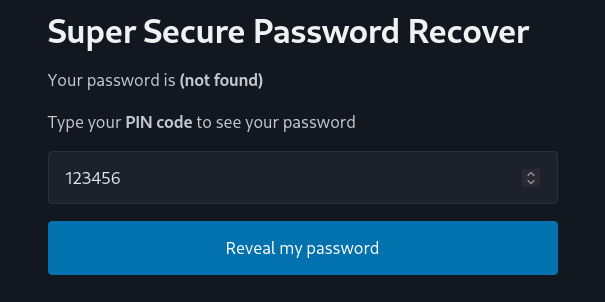
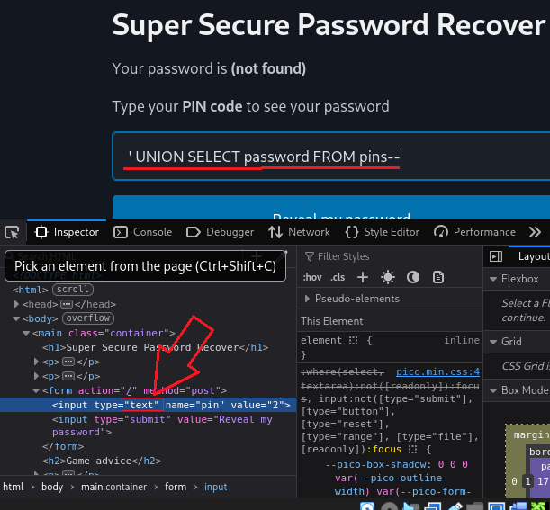
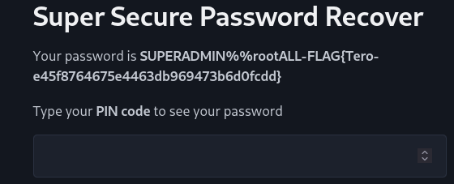
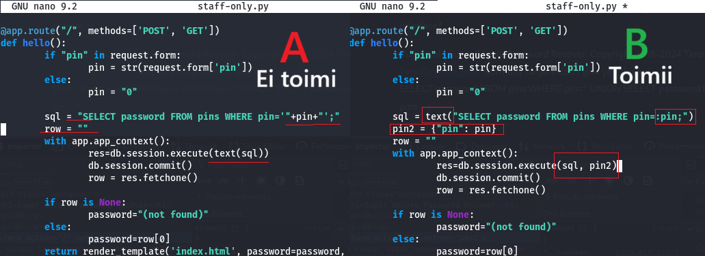

## x) OWASP Top 10: A01 Broken Access Control  
Broken Access Control on tapahtuma, milloin sovellus ei tarkista käyttäjän käyttöoikeuksia.  
Tämän ansiosta käyttäjä voi päästä vaikka admin sivulle tai muualle, josta tietoja voidaan varastaa.  
Tavallisia tapoja saada tämä aikaiseksi ovat:  
- Käyttöoikeuksien valvonnan ohittaminen muokkaamalla URL-osoitetta  
- API:n käyttäminen ilman asianmukaisia ​​pääsynvalvontatoimia POST-, PUT- ja DELETE-operaatioissa  
- Käyttöoikeuksien korottaminen  
- Metatiedon manipulointi, kuten JSON Web Tokenin uudelleenlähetys tai peukalointi  
(OWASP, 2021)

## Karvinen 2023: Find Hidden Web Directories - Fuzz URLs with ffuf  
ffuf on web fuzzeri, jonka avulla voit löytää piilotettuja hakemistoja.  
Artikkelissa käydään läpi, miten ffufia käytetään.  xxxxx
(Karvinen 2023)  

## PortSwigger: Access control vulnerabilities and privilege escalation  

## Karvinen 2006: Report Writing (in Finnish)  
Sivulla kerrotaan, miten hyvä raportti voidaan kirjoittaa.  
Muutama tärkeä ja kiinnostavia seikkoja:  
- Jos vikoja tapahtuu, on niistä hyvä raportoida. Muuten on melkein mahdotonta yrittää selvittää syytä niihin.  
- Lähteisiin viittaaminen on melko tärkeää.  
- On tärkeää kirjoittaa tismallisesti, mitä on tehnyt.
  (Karvinen 2006)

 

Työympäristö:  
VirtualBox virtuaalikone:    
Kali-linux 2026.2 kali-rolling  
Selain on kalin oletus, Mozilla Firefox  
Verkkoyhteys NAT adapterilla  

En ensisijaisesti käytä ulkoisia työkaluja, mutta tuon ne esiin tehtäväkohtaisesti, jos niitä käytän.  

## a) Break into 010-staff-only. See Karvinen 2024: Hack'n Fix  
Tässä tehtävässä halutaan PIN, jonka avulla saadaan admin salasana.  
Syötteellä 123 saadaan "Somedude" ja kaikilla muilla arvoilla 0123, 10, 999 salasanan arvoksi tulee "not found"  
Satunnaisesti syötettyä 321, salasanan arvoksi tuli "foo"  

Tästä eteenpäin en enää ymmärtänyt, mitä tehdä ja suuntasin kohti vinkkejä. Ja siitä oppaisiin  
  

Robin Niinemetsin raportista näkyi, miten PIN-koodi kenttään on mahdollista kirjoittaa tekstiä pienen muokkauksen jälkeen.  

Robin Niinemetsin mukaan PortSwiggerissä kerrottin UNION hyökkäyksestä (UNION attack)  
ja tämän avulla on mahdollista käyttää yhtä tai useita SELECT lauseita.  
Tämän tavan avulla Robin sai koottua hyökkäyslauseen: ' UNION SELECT password FROM pins--  
(Niinemets 2024)  
  
  

## b) Fix the 010-staff-only vulnerability from source code  
Niinemetsin raportista käy ilmi, kuinka sivuston koodin pystyy korjaaman.  
Se tehdään uudella pin2 muuttujalla mihin käyttäjän syöte tallennetaan ja yhdistetään execute() funktiossa.  
(Niinemets 2024)  
  

## c) Solve dirfuzt-1 from the article Karvinen 2023  

## d) Break into 020-your-eyes-only  

## e) Fix the 020-your-eyes-only vulnerability  

Lähteet:  
OWASP: https://owasp.org/Top10/2021/A01_2021-Broken_Access_Control/index.html  
Karvinen 2023: https://terokarvinen.com/2023/fuzz-urls-find-hidden-directories/  
Karvinen 2006: https://terokarvinen.com/2006/raportin-kirjoittaminen-4/  
Robin Niinemets: https://rbin.dev/writing/SH24-002  
