# h3 No Strings Attached  

## a) Run 'passtr'. Find the correct password using 'strings'. Also find the flag  
Aloitin tästä:  
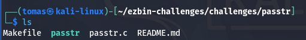  

Salasanan etsimisen voi tehdä monella tavalla.  
Yksi tapa on käyttää stringejä:  
(Huomasin tämän vasta lopuksi, kun olin jo piilottanut salasanan)  
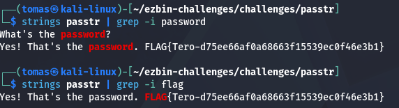  

Toinen tapa olisi katsoa "passtr" tiedoston sisään:  
**cat passtr**  
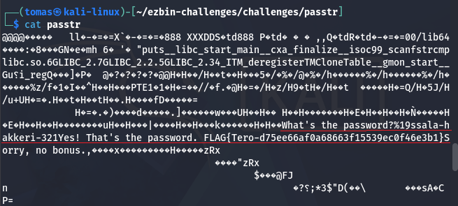   

Kolmas tapa on nähdä se "passtr.c" tiedoston sisältä:  
**cat passtr.c**  
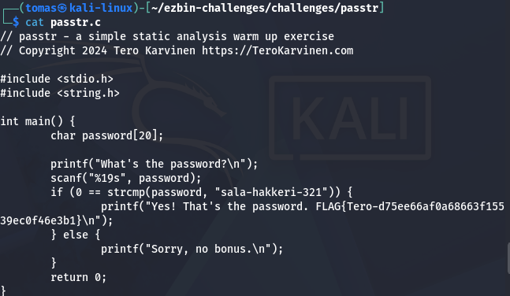  

**./passtr** käynnistää esitetyn ohjelman nykyisessä työhakemistossa ja salasanan annettua päästään läpi:  
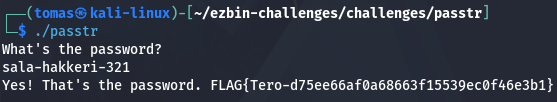  

## b) Make a new version of the passtr.c program where the password doesn't appear directly as-is in the binary. Demonstrate with a test that the password doesn't appear. (Obfuscation is sufficient.)  

Aloitan tästä. Se on tiedosto "passtr.c" nano tekstieditorissa.  
Tässä vaiheessa tiedostoa ei olla muokattu.  

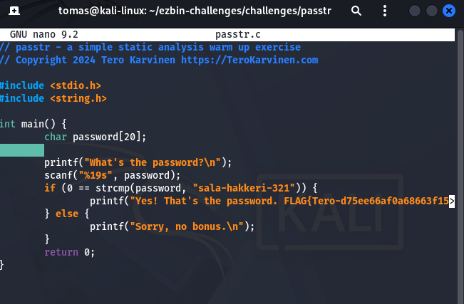  

Syötin koodinpätkän, jonka tarkoituksena on luoda salasanalle obfuskointi.  

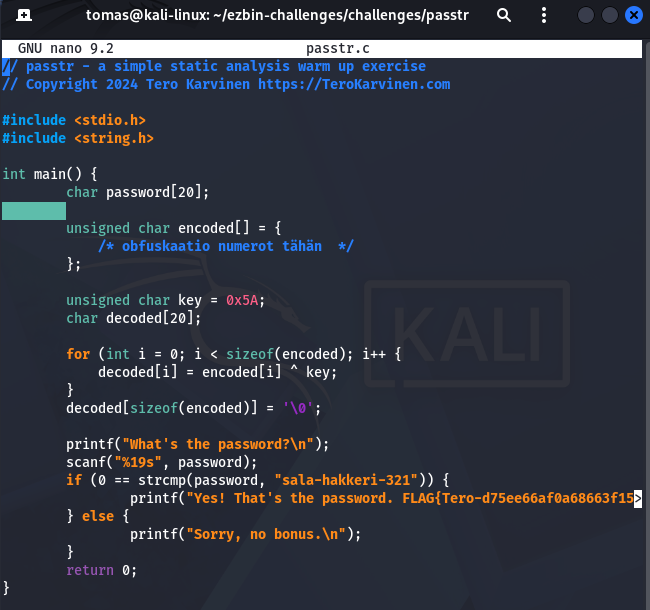  

Tässä salasanan jokainen kirjain muutetaan numeroiksi:  

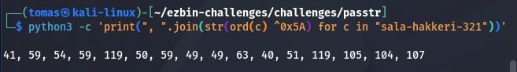  

Ja arvojen saatua ne lisätään tiedostoon:  

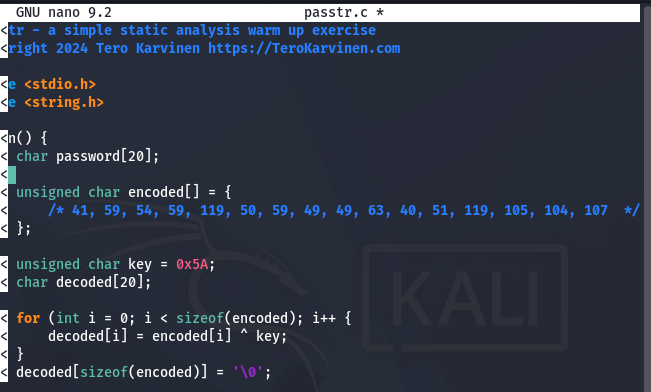  

Tässä tiedosto muunnetaan suoritettavaksi, mutta tämän sisällä oli syntaksivirhe.  
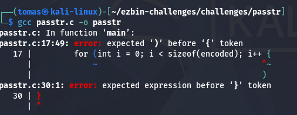  

Korjaus syntaksiin. Lisäämällä puuttuva ")"  
Tämän jälkeen suoritin edellisen kuvan komennon uudelleen.  
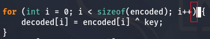  

 

 

Testasin kaiken luodun toimivuutta mutta tämä ei täysin vielä toimi:  
**grep sala-hakkeri passtr.c**  
tuloksena: if (0 == strcmp(password, "sala-hakkeri-321")) {  

Joten muutin tiedoston "passtr.c" koodia lisää:  

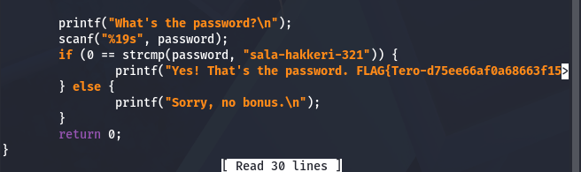  

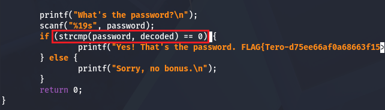  

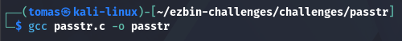  

Onnistuin tekemään salasanasta käyttökelvottoman:  
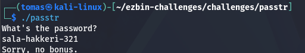  

Poistin kommenttikentän.  
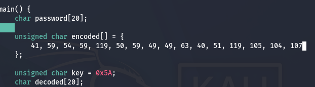  

Käytin äskeisen jälkeen **gcc passtr.c -o passtr**. Tämän jälkeen **./passtr** salasanan testausta varten.  
salasana toimi.  
Seuraavaksi testaan, että salasana on piilossa tiedostossa "passtr"  

Tässä vielä binääri ennen:  
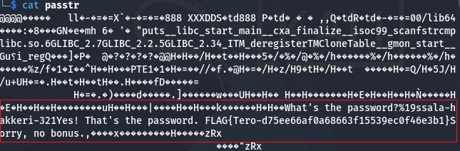  

Ja jälkeen:  
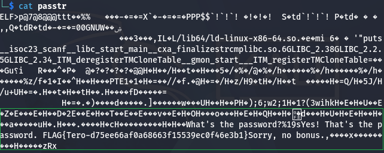  

> **Note:** Tiedostojen koodi ja komentorivien komennot luotiin ChatGPT Versiolla 5.6  

## c) Run 'packd' from the package ezbin-challenges.zip. What is the password? What is the flag?  
Packd tiedosto on paketoitu UPX:llä  
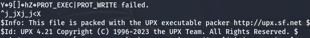  

Purin sen:  
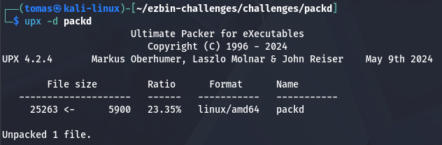  

Menin seuraavaksi täysin autopilotti moodissa kirjoittamaan:  
**cat packd**  

Tässä tuskin oli tarkoitus katsoa suoraan binääristä.  

