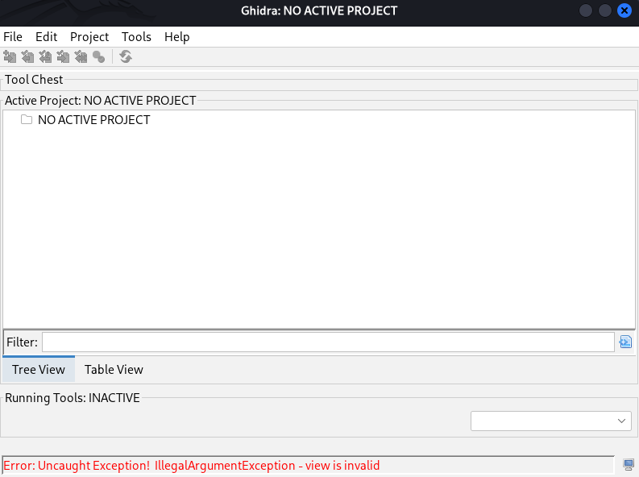
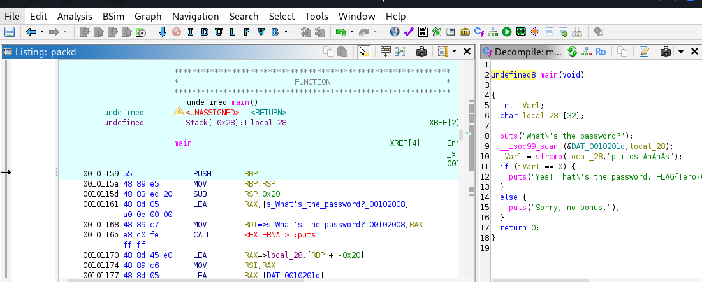
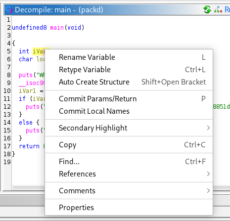
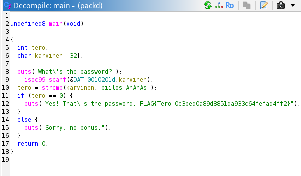

# h4 Some Disassembly Required  

## x) Read/watch/listen and summarize  

### Hammond 2022: Ghidra for Reverse Engineering (PicoCTF 2022 #42 'bbbloat')  

## a) Install Ghidra.  
Ghidran oletusnäkymä:  
  

## b) rever-C. Reverse engineer the packd binary to C language with Ghidra. Find the main program. Give variables descriptive names. Explain the program's operation. Solve the task from the binary, without the original source code. ezbin-challenges.zip  

Packd dekompiloituna:  
  

Muuttujien nimien vaihto:  
  

Mitä koodissa tapahtuu?  
  
int tero; varaa muistipaikan kokonaisluvulle.  
char karvinen [32]; varaa tilaa merkkijonolle. Vain 32 tavua tilaa.  
(puts("What\'s the password?"); tulostaa viestin, jossa lukee "whats the password?"  
__isoc99_scanf funktio odottaa syötettä, (&DAT_0010201d ohjeistaa funktion lukemaan syötteen tekstinä, ja karvinen); muuttuja, jonne salasana tallennetaan.  
tero = strcmp vertaa tero muuttujaan annettua syötettä ja (karvinen, "AnAnAs"); jossa karvinen on käyttäjän tallennettu syöte.  
if (tero == 0) jos tero on 0 tulostaa rivin 12, jossa lippu. Jos tero ei ole 0 tapahtuu else, jossa tulostuu "Sorry, no bonus" ja siirtyy ohjelman loppuun, jossa ohjelma suljetaan.  

## c) If backwards. Modify the passtr program's binary (without the original source code) so that it accepts all passwords except the correct one. Demonstrate with tests that the program works. ezbin-challenges.zip  

## d) Nora CrackMe: Compile to binaries Tindall 2023: NoraCodes / crackmes. Read README.md: don't look at the source code unless you need training wheels. In these tasks, binaries are reverse engineered. Binaries are not modified, because otherwise the solution to every task would be to change the return value to "return 0".  

## e) Nora crackme01. Solve the binary.  

## e) Nora crackme01e. Solve the binary.  

## f) Nora crackme02. Name the main program's variables from the reverse-engineered binary and explain the program's operation. Solve the binary  
