# h4 Some Disassembly Required  

## x) Read/watch/listen and summarize  

### Hammond 2022: Ghidra for Reverse Engineering (PicoCTF 2022 #42 'bbbloat')  
Videolla käydään läpi eri tapoja purkaa koodia. Ghidrasta esitetään tämän perustoiminnoista ja asetuksista.  
Ghidrasta näytetään, miten koodia tuodaan ja dekompiloidaan siellä. Dekompiloituna koodia on helpompi lukea ja selkeyttää tulkintaa.  
Hammond käy ghidrassa dekompiloitua koodia läpi ja etsii vihjeitä, jotta lopuksi saa suoritettua picoCTF haasteen.  
Hän käyttää myös muita sovelluksia, mutta ghidraa käytetään videolla eniten.  
(Hammond, 2022)  

## a) Install Ghidra.  
Ghidran oletusnäkymä:  
  

## b) rever-C. Reverse engineer the packd binary to C language with Ghidra. Find the main program. Give variables descriptive names. Explain the program's operation. Solve the task from the binary, without the original source code. ezbin-challenges.zip  
> **Note** Työn tukena käytetty teköälyä Gemini 3.5 Flash  

Packd dekompiloituna:  
  

Muuttujien nimien vaihto:  
  

Mitä koodissa tapahtuu?  
  
int tero; varaa muistipaikan kokonaisluvulle.  
char karvinen [32]; varaa tilaa merkkijonolle. Vain 32 tavua tilaa.  
(puts("What\'s the password?"); tulostaa viestin, jossa lukee "whats the password?"  
__isoc99_scanf funktio odottaa syötettä, (&DAT_0010201d ohjeistaa funktion lukemaan syötteen tekstinä, ja karvinen); muuttuja, jonne salasana tallennetaan.  
tero = strcmp vertaa tero muuttujaan annettua syötettä ja (karvinen, "AnAnAs"); jossa karvinen on käyttäjän tallennettu syöte.  
if (tero == 0) jos tero on 0 tulostaa rivin 12, jossa lippu. Jos tero ei ole 0 tapahtuu else, jossa tulostuu "Sorry, no bonus" ja siirtyy ohjelman loppuun, jossa ohjelma suljetaan.  
> **Note** Työn tukena käytetty teköälyä Gemini 3.5 Flash  

## c) If backwards. Modify the passtr program's binary (without the original source code) so that it accepts all passwords except the correct one. Demonstrate with tests that the program works. ezbin-challenges.zip  
> **Note** Työn tukena käytetty teköälyä Gemini 3.5 Flash  

Perusnäkymä passtr:  
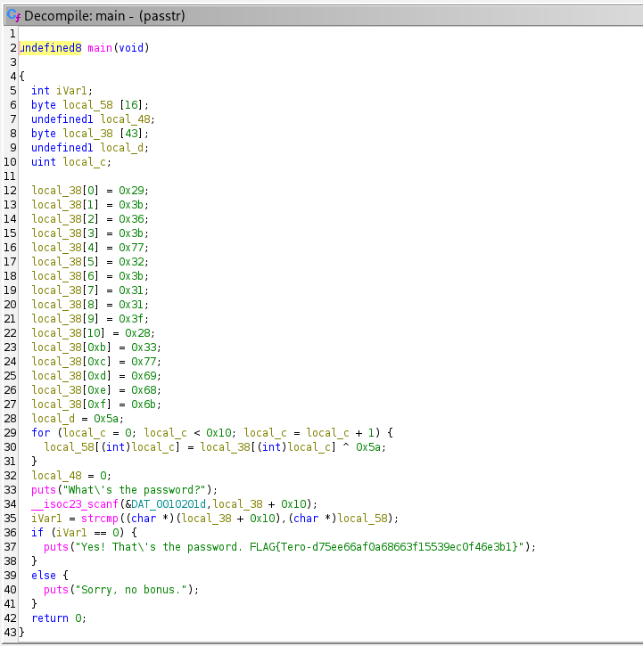  

On vaihdettava if (iVarl == 0), jotta saadaan oikeasta salasanasta väärin vastaus.  
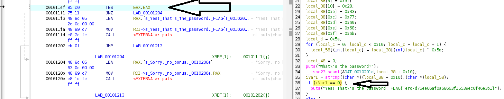  

Jump if Not Zero (JNZ) muokkaamiseen käytetään vain patch instruction:  
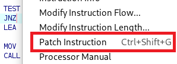  

Ja poistamalla kirjain saadaan Jump if Zero (JZ).  
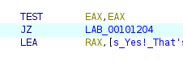  

Seuraavaksi on testattava, että tämä toimii.  
Tallensin ja exporttasin alkuperäisenä.  
Annoin valtuudet ajamiseen:  
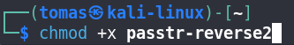  

Testaus. Oikea ja sitten väärät salasanat.  
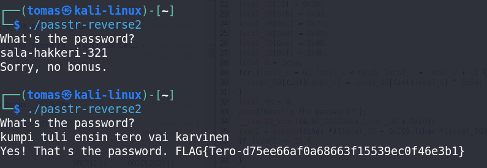 
> **Note** Työn tukena käytetty teköälyä Gemini 3.5 Flash  

## d) Nora CrackMe: Compile to binaries Tindall 2023: NoraCodes / crackmes. Read README.md: don't look at the source code unless you need training wheels. In these tasks, binaries are reverse engineered. Binaries are not modified, because otherwise the solution to every task would be to change the return value to "return 0".  
> **Note** Työn tukena käytetty teköälyä Gemini 3.5 Flash  

Latasin CrackMe tiedoston ZIP tiedostona.  
purin ja käänsin, jonka jälkeen avasin tiedoston ghidrassa:  
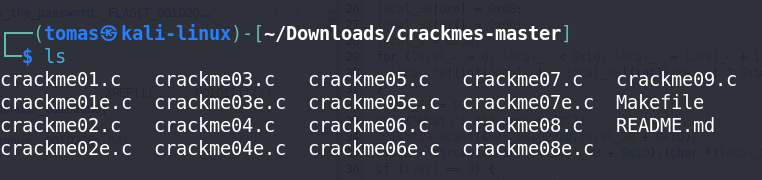  
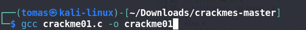  
> **Note** Työn tukena käytetty teköälyä Gemini 3.5 Flash  

## e) Nora crackme01. Solve the binary.  
> **Note** Työn tukena käytetty teköälyä Gemini 3.5 Flash  

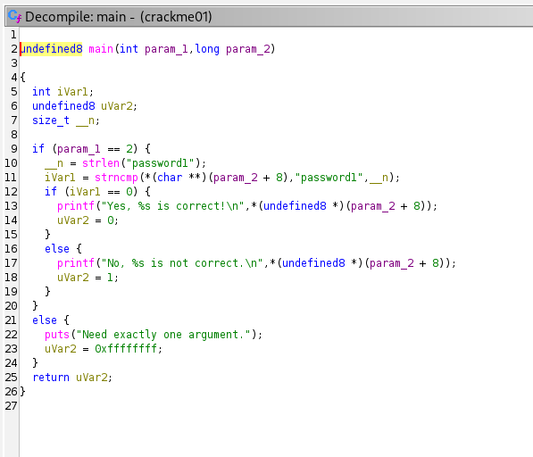  
Koodissa suurinpiirtein näkyy password1 ainoana suorana salasanana.  
Tämä myös toimi.  
En itse tunnista, mitä koodissa vertaillaan.  
Muuten koodissa esitetään, mitä tapahtuu kun todetaan kyllä, ei tai virhe.  
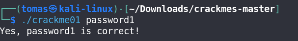  
> **Note** Työn tukena käytetty teköälyä Gemini 3.5 Flash  

## e) Nora crackme01e. Solve the binary.  
> **Note** Työn tukena käytetty teköälyä Gemini 3.5 Flash  

Tässä on 01e, jossa nopeasti nähdään "slm!paas.k", joka näyttää ja on salasana.  
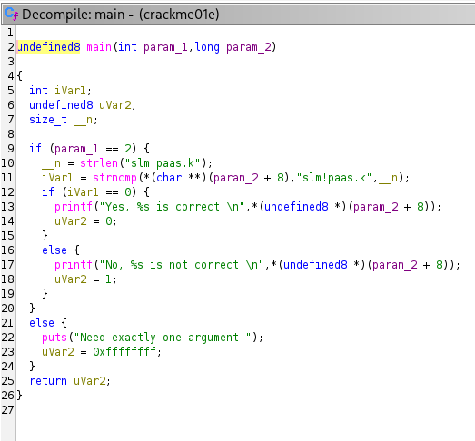  

Salasanaan tarvitaan vain heittomerkit, jotta se tunnistetaan normaalina tekstinä.  
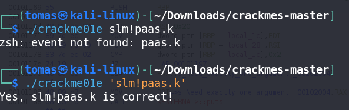  
> **Note** Työn tukena käytetty teköälyä Gemini 3.5 Flash  

## f) Nora crackme02. Name the main program's variables from the reverse-engineered binary and explain the program's operation. Solve the binary  
> **Note** Työn tukena käytetty teköälyä Gemini 3.5 Flash

Ydin asia mitä sain salasanasta ymmärrettyä on, että käyttäjän antamasta salasanasta vähennetään arvolla 1, eli kun kyseessä on kirjaima, niin mennään kirjain alaspäin.  
Tärkeimmät muuttujat ovat param_1, se pitää huolen, että ohjelmalle on annettu vain yksi syöte. param_2 pitää sisällään käyttäjän arvatun salasanan.  
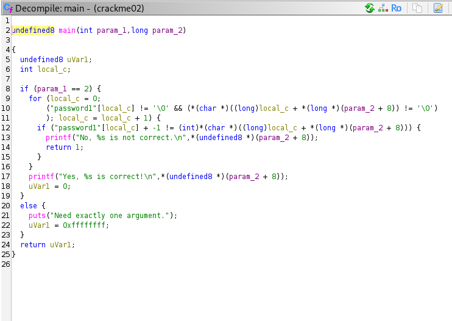  

Salasana tulee sanasta "password1" mutta jokaisesta merkistä vähennetään arvolla 1.  
"a" ASCII:n mukaan muuttuu arvoksi " ` ".  
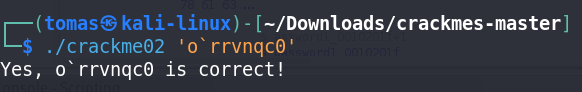  
> **Note** Työn tukena käytetty teköälyä Gemini 3.5 Flash  

Lähteet:  
John Hammond. GHIDRA for Reverse Engineering (PicoCTF 2022 #42 'bbbloat'). https://www.youtube.com/watch?v=oTD_ki86c9I  
NoraCodes. crackme. https://github.com/NoraCodes/crackmes  
