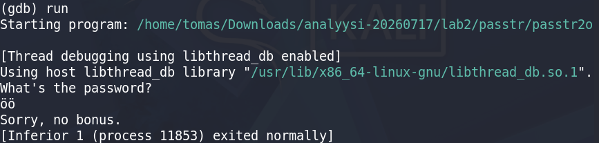
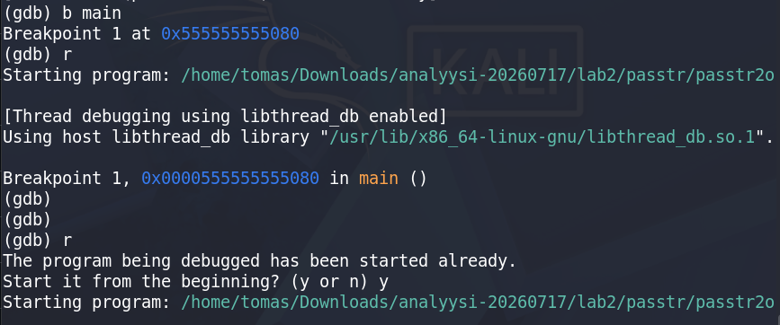

# h5 Binääri tässä, missä koodit? (Lari)  
## Lab0.zip - Harjoitellaan tunnilla itsenäisesti debuggerin käyttöä. Etsitään virhe ja pyritään korjaamaan se.  

## Lab1.zip - Harjoitellaan tunnilla itsenäisesti. Etsitään, miksi ohjelma kaatuu ja voidaanko se korjata.  

## Lab2.zip - kotitehtävä. Ohjelma on käännetty, mutta koodit ovat päässeet katoamaan. Tehtävänä on löytää ohjelman kysymä uusi salasana ja ohjelman tulostama lippu. Kirjoita dokumentti siitä, miten sait nämä selville. Sekä mitä uutta opit GNU Debuggerista, että mitä et oppinut tunnilla.  

Käsillä on ohjelma, joka kysyy salasanaa. Oikeaa salasanaa ei vielä ole.  
Aloin heittelemään komentoja:  
  

  

## Lab3.zip - Tiedostossa on Nora Crackme -haasteita. Valitse yksi tiedosto ja yritä ratkaista binäärin salasana. Kirjoita tästä dokumentti, miten sait salasanan selville.  

