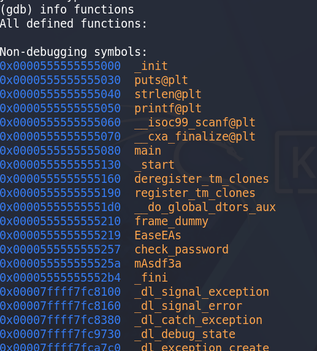
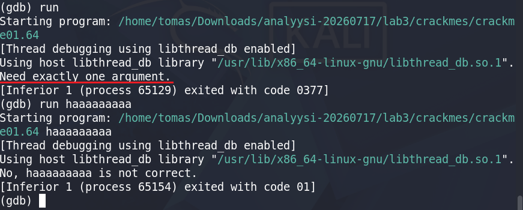
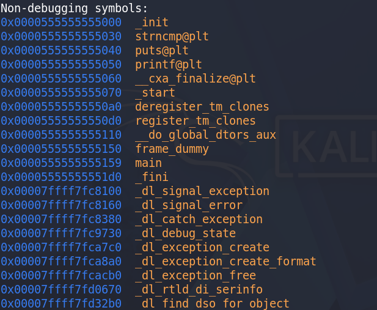

# h5 Binääri tässä, missä koodit? (Lari)  

## Lab2.zip - kotitehtävä. Ohjelma on käännetty, mutta koodit ovat päässeet katoamaan. Tehtävänä on löytää ohjelman kysymä uusi salasana ja ohjelman tulostama lippu. Kirjoita dokumentti siitä, miten sait nämä selville. Sekä mitä uutta opit GNU Debuggerista, että mitä et oppinut tunnilla.  

Käsillä on ohjelma, joka kysyy salasanaa. Oikeaa salasanaa ei vielä ole.  
Aloin heittelemään komentoja, mutta ne eivät suorastaan olleet hyödyllisiä:  
  

  

**info functions** ei suoraan antanut hyödyllistä tietoa.  
Tämä antoi silti idean, kuinka ohjelma voisi olla toisessa muodossa, jotta tästä ymmärtäisi jotain.  
En kyllä tiedä miten teen sen.  
En ymmärrä, miten tästä voi jatkaa.  
  

Opin GNU:sta pari komentoa:  
run = käynnistää ohjelman  
break = keskeyttää koodin tietyssä kohdassa  
delete [1] = poistaa breakpointin arvolla 1  
info breakpoints = perus näkymä kaikista breakpointeista  
info functions = ohjelman kaikki funktiot listattuna  

## Lab3.zip - Tiedostossa on Nora Crackme -haasteita. Valitse yksi tiedosto ja yritä ratkaista binäärin salasana. Kirjoita tästä dokumentti, miten sait salasanan selville.  

Valitsin crackme01.64  
  
  

Sama ongelma taas. En tiedä, miten jatkaa.  
Kaikki funktiot ovat listattu mutta miten niitä voi hyödyntää?  
En tiedä, millä komennoilla näistä saa uutta irti.  
  

