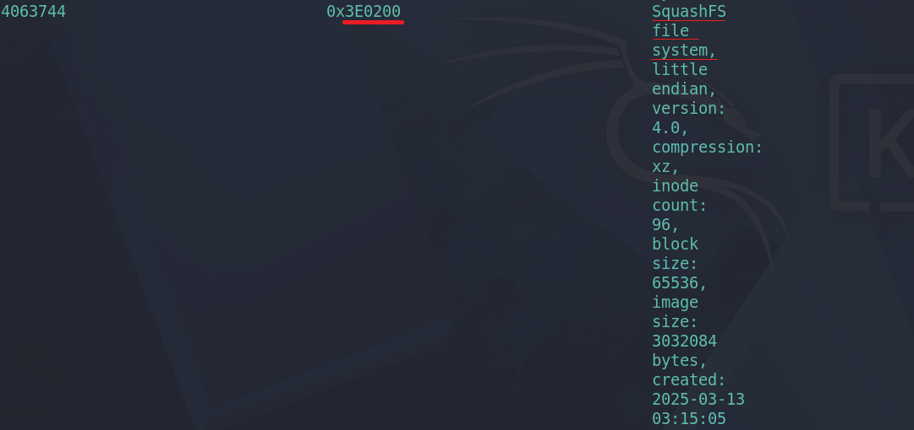
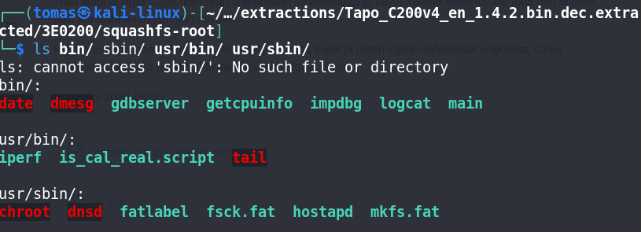
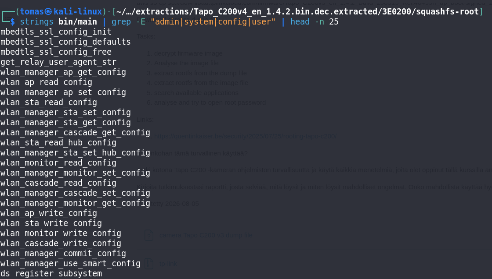
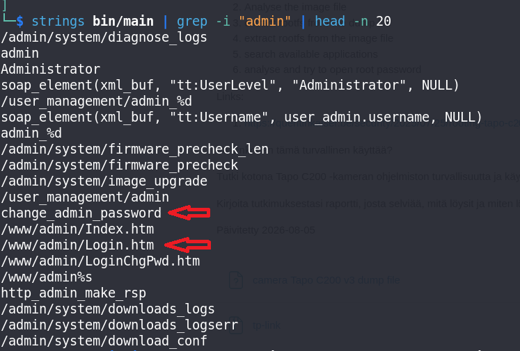

# h6 Onkohan tämä turvallinen käyttää?  

- Tutki kotona Tapo C200 -kameran ohjelmiston turvallisuutta ja käytä kaikkia menetelmiä, joita olet oppinut tällä kurssilla analyysin tekemiseen.  
- Kirjoita tutkimuksestasi raportti, josta selviää, mitä löysit ja miten löysit mahdolliset ongelmat. Onko mahdollista käyttää hyödyksi löytämiäsi haavoittuvuuksia.

> **Note:** Aihe menee yli älyn, tukena käytetty tekoälyä, Gemini Flash 3.5  

Purin C200 kameran ohjelmistotiedoston ja menin tämän päähakemistoon, **squashfs-root**,  
Joka tuli puretusta ohjelmasta.  
Ajoin **ls bin/ usr/bin/ usr/sbin/**  
jonka avulla näkee laitteen eri ohjelmia.  
Pääohjelma "main" on siellä.  

Komento: **binwalk3 Tapo_C200v4_en_1.4.2.bin.dec**  
  
  

Ajoin aluksi komennon, jolla tiedostosta suodatetaan vain admin, system, config, user sanat ja vain 25 niistä esitetään.  
Tarkoitus on etsiä lisää tietoa bin/main sisältä.  
  

Sitten ajoin **strings bin/main | grep -i "admin"**  
Komento on melkein sama, kuin edellisessä. Tässä etsitään vain sanaa "admin" tiedostosta.  
Kuvassa näkee salasana vaihdon **change_admin_password** ja **/www/admin/login.htm**  
Ongelmallisena on siis näiden eri ohjelmien olevan kaikki "main" kansion alla.  
Jos main kansioon päästään sisälle, saadaan pääsy kaikkiin näihin eri toimintoihin.  
  

